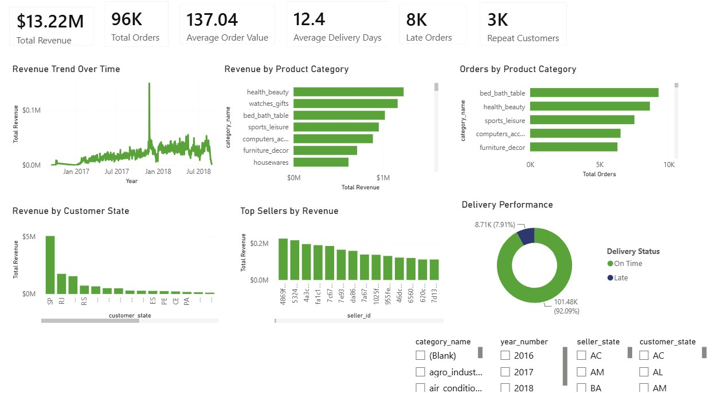
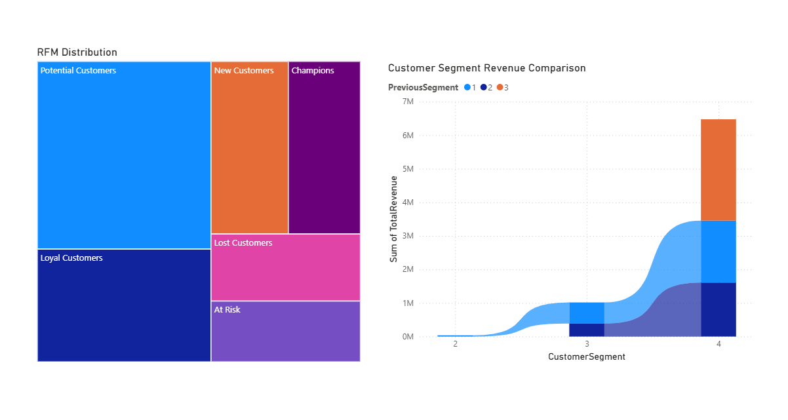
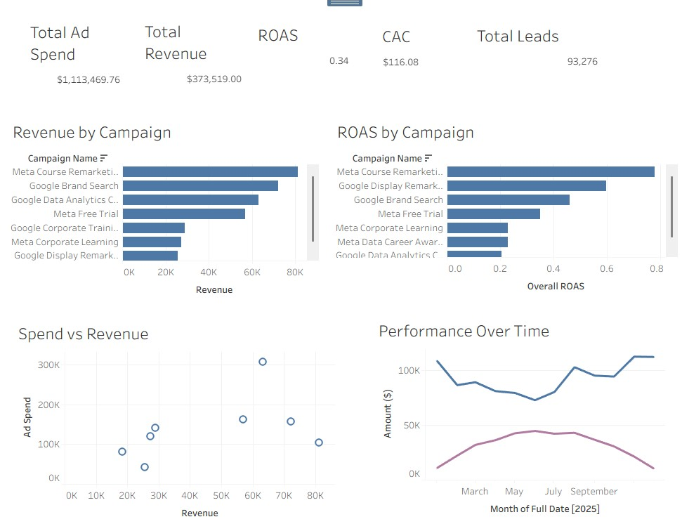
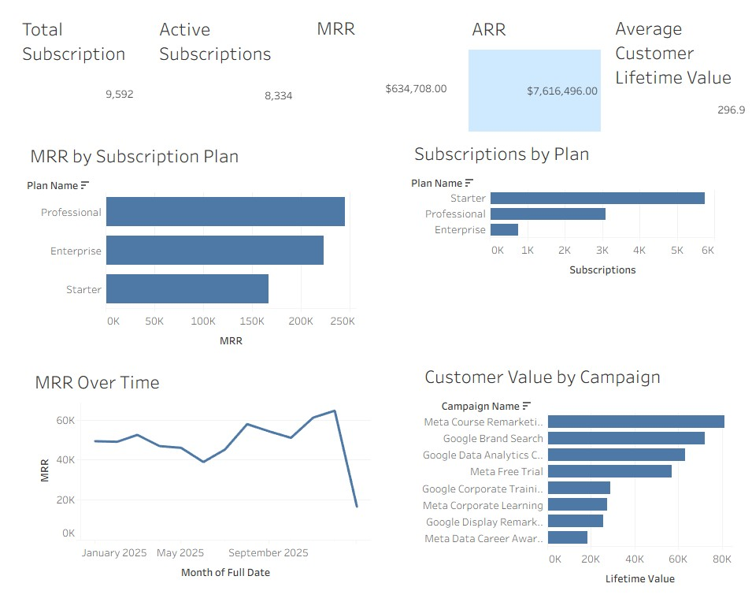

# 📊 Portafolio de Análisis de Datos

### SQL · Power BI · Tableau · Python · Excel · Business Intelligence

**Transformando datos de negocio en insights accionables para una mejor toma de decisiones.**

---

## 👋 Sobre este portafolio

¡Hola! Soy **Juan David Guerrero**, Analista de Datos con formación en Administración de Empresas y enfoque en **Business Intelligence, análisis de datos y toma de decisiones basada en datos**.

Este portafolio reúne proyectos end-to-end en **e-commerce, ventas, clientes, marketing y logística**, utilizando herramientas como SQL, Power BI, Tableau, Python y plataformas modernas de datos.

### 🔄 Proceso Analítico

**Problema de Negocio → Preparación de Datos → Análisis → KPIs → Dashboard → Insights → Recomendaciones**

---

# 📂 Proyectos

| Proyecto | Enfoque | Stack Principal |
|:---|:---|:---|
| 🛒 **Olist Marketplace** | Ventas · Productos · Logística | SQL Server · Power BI |
| 🚲 **AdventureWorks** | Ventas · Clientes · Territorios | SQL · Power BI · Databricks |
| 📈 **LearnLoop** | Marketing · Funnel · Clientes | SQL · Tableau · Snowflake · dbt |

---

# 🛒 Olist Marketplace Analytics

### Sales & Logistics Analytics

**SQL Server · SQL · Power BI · ETL · Data Warehousing**

### 🎯 Objetivo

Transformar datos fragmentados de un marketplace brasileño de e-commerce en una solución analítica para evaluar:

**Ingresos · Ventas · Productos · Clientes · Vendedores · Rendimiento de Entregas**

---

## 📊 Dashboard

---

## 🔎 Principales Insights

| KPI / Hallazgo | Resultado |
|:---|:---|
| 💰 Ingresos por productos | **R$13.22M** |
| 📦 Pedidos entregados | **96,478** |
| 🛒 Valor promedio por pedido | **R$137.04** |
| 📈 Crecimiento de pedidos | **~140%** |
| 🧴 Categoría líder | **Salud y Belleza — R$1.23M** |
| 📍 Principal mercado | **São Paulo — 38.3% de ingresos** |
| 🚚 Tiempo promedio de entrega | **12 días** |
| ⚠️ Pedidos entregados tarde | **8.11%** |

### 💡 Recomendaciones

- Proteger y expandir las categorías con mejor desempeño.
- Investigar los principales factores asociados a retrasos en las entregas.
- Explorar oportunidades de crecimiento fuera de los mercados con alta concentración.
- Evaluar categorías combinando **ingresos y volumen de ventas**.
- Monitorear la evolución del marketplace y los cambios en los patrones de compra.

### 🛠️ Habilidades Demostradas

`SQL` `Power BI` `ETL` `Data Cleaning` `Star Schema` `Dimensional Modeling` `KPI Analysis` `Sales Analytics` `Logistics Analytics`

### 🔗 Repositorio

➡️ [**Ver proyecto completo de Olist Marketplace**](https://github.com/juandguerrero/Olist-Marketplace-Sales-Logistics-Analytics)

---

 

# 🚲 AdventureWorks Sales Analytics

### End-to-End Sales & Customer Analytics Platform

**SQL · Power BI · Python · Databricks · PySpark · AWS S3 · Apache Airflow**

### 🎯 Objetivo

Construir una plataforma analítica end-to-end para comprender:

**Ventas · Clientes · Productos · Territorios · Vendedores · Retención**

Los datos operacionales fueron transformados en datasets analíticos estructurados para soportar análisis de negocio y dashboards de Business Intelligence.

---

## 📊 Executive Sales Dashboard

---

## 👥 Customer Segmentation

---

## 🚲 Product Analytics

---

## 🔎 Principales Insights

| Área | Hallazgo |
|:---|:---|
| 💰 Estacionalidad | **Primavera generó $29.52M** |
| 🚲 Productos | **Bicicletas = ~87.7% de los ingresos** |
| 🌎 Territorios | **Southwest generó ~$24M** |
| 🏆 Ventas | **Top salesperson generó ~$10.3M** |
| 👥 Clientes | Segmentación mediante **RFM** |
| ⚠️ Retención | Identificación de segmentos con riesgo de **churn** |

### 💡 Recomendaciones

- Proteger y continuar desarrollando el negocio principal de bicicletas.
- Incrementar oportunidades de **cross-selling** mediante accesorios y ropa.
- Priorizar territorios de alto desempeño e investigar mercados con menor rendimiento.
- Utilizar la segmentación RFM para campañas de retención específicas.
- Analizar y replicar prácticas de los vendedores con mejor desempeño.
- Alinear inventario y promociones con los patrones estacionales de demanda.

### 🛠️ Habilidades Demostradas

`SQL` `Power BI` `Python` `RFM` `Churn Analysis` `CLV` `Sales Analytics` `Databricks` `PySpark` `Airflow`

### 🔗 Repositorio

➡️ [**Ver proyecto completo de AdventureWorks**](https://github.com/juandguerrero/AdventureWorks-Sales-Analytics-Platform)

---

 

# 📈 LearnLoop Marketing Analytics

### End-to-End Marketing Analytics Platform

**SQL · Tableau · Snowflake · dbt · Python · Airflow · AWS S3**

### 🎯 Objetivo

Construir una plataforma de analítica de marketing que conecte datos provenientes de:

**Publicidad · Sitio Web · CRM · Suscripciones · Cursos · Ingresos**

El modelo conecta el recorrido completo del cliente:

**Ad Spend → Sessions → Leads → MQLs → SQLs → Customers → Subscriptions → Revenue**

Esto permite evaluar marketing utilizando **clientes e ingresos reales**, en lugar de limitar el análisis a métricas como clics o impresiones.

---

## 📊 Campaign Performance

---

## 🎯 Marketing Funnel

---

## 💰 Subscription & Customer Value

---

## 🔎 Principales Insights

| KPI | Resultado |
|:---|---:|
| 💵 Ad Spend | **$1.11M** |
| 💰 Revenue | **$373.5K** |
| 📉 ROAS | **0.34x** |
| 👤 CAC | **$116.08** |
| 🌐 Website Sessions | **740,283** |
| 🎯 Leads | **93,276** |
| 👥 Customers | **9,592** |
| 🔄 Lead → Customer | **~10.3%** |
| 📊 Session → Customer | **~1.3%** |
| 🎓 Course Enrollments | **16,628** |

### 💡 Recomendaciones

- Reasignar presupuesto hacia campañas con mayor **ROAS**.
- Establecer objetivos de **ROAS y CAC** por campaña.
- Mejorar la conversión del funnel antes de aumentar la adquisición de tráfico.
- Evaluar CAC conjuntamente con **Customer Lifetime Value**.
- Optimizar la inversión utilizando **clientes e ingresos** como métricas principales de negocio.

### 🛠️ Habilidades Demostradas

`SQL` `Tableau` `Marketing Analytics` `Funnel Analysis` `ROAS` `CAC` `CLV` `MRR` `ARR` `Snowflake` `dbt` `Python`

### 🔗 Repositorio

➡️ [**Ver proyecto completo de LearnLoop**](https://github.com/juandguerrero/LearnLoop-Marketing-Analytics-Platform)

---

 

# 🛠️ Stack Técnico

| Área | Tecnologías |
|:---|:---|
| 📊 **Data Analysis** | SQL · Python · Excel |
| 📈 **Business Intelligence** | Power BI · Tableau |
| 🗄️ **Databases & Warehousing** | SQL Server · Snowflake |
| 🧱 **Data Modeling** | Star Schema · Dimensional Modeling |
| 📣 **Marketing Analytics** | ROAS · CAC · CLV · Funnel Analysis |
| 👥 **Customer Analytics** | RFM · Churn · Segmentation |
| ⚙️ **Data Transformation** | SQL · dbt · PySpark |
| ☁️ **Cloud & Data Platforms** | AWS S3 · Databricks |
| 🔄 **Orchestration** | Apache Airflow |
| 🔧 **Version Control** | Git · GitHub |

---

# 🎯 Mi Enfoque como Analista

Para mí, la analítica no termina al construir un dashboard o escribir una consulta SQL.

El objetivo es convertir los datos en respuestas para cuatro preguntas de negocio:

### ¿Qué está pasando?

### ¿Por qué está pasando?

### ¿Dónde están las oportunidades?

### ¿Qué debería hacer el negocio a continuación?

Mi enfoque combina **análisis de datos, conocimiento de negocio, Business Intelligence y visualización** para transformar información en decisiones accionables.

---

# 👨‍💻 Sobre Mí

Soy **Analista de Datos con formación en Administración de Empresas**, combinando conocimiento de negocio con habilidades técnicas de analítica.

Trabajo principalmente con:

**SQL · Power BI · Tableau · Excel · Python**

También he desarrollado soluciones utilizando:

**Snowflake · dbt · Databricks · PySpark · AWS S3 · Apache Airflow**

### 🎯 Áreas de Interés

`Data Analytics` · `Business Intelligence` · `Marketing Analytics` · `Commercial Analytics`

---

# 📫 Contacto

### Juan David Guerrero

**Data Analyst**

[LinkedIn](https://www.linkedin.com/in/juan-david-guerrero-parada/) · **juangrp12@gmail.com**

 

⭐ **Explora los proyectos para ver dashboards, análisis SQL, modelos de datos, insights y recomendaciones de negocio.**

